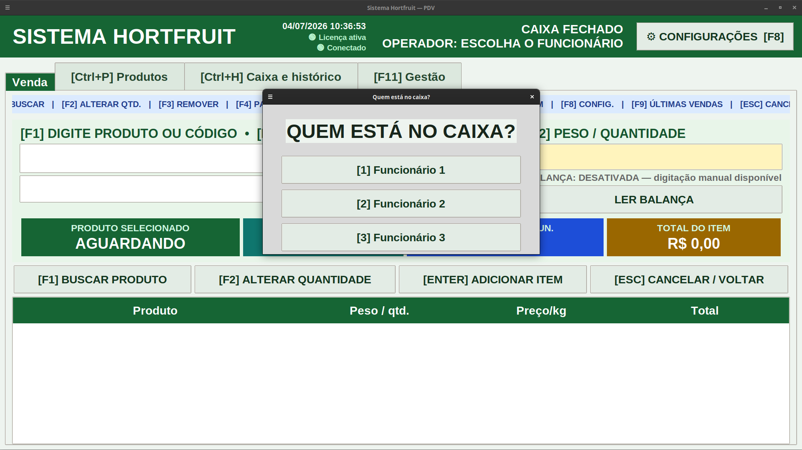
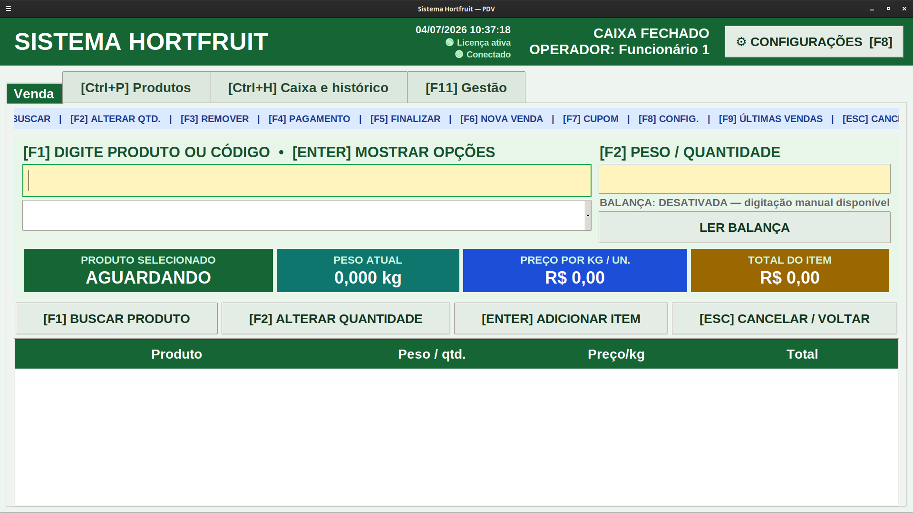
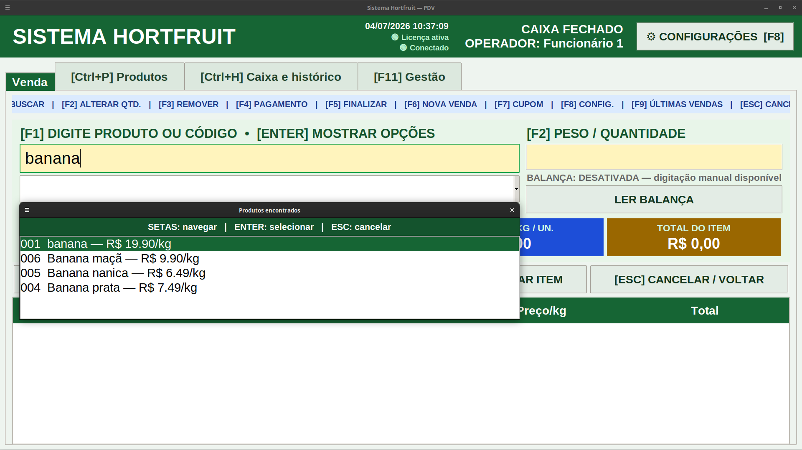
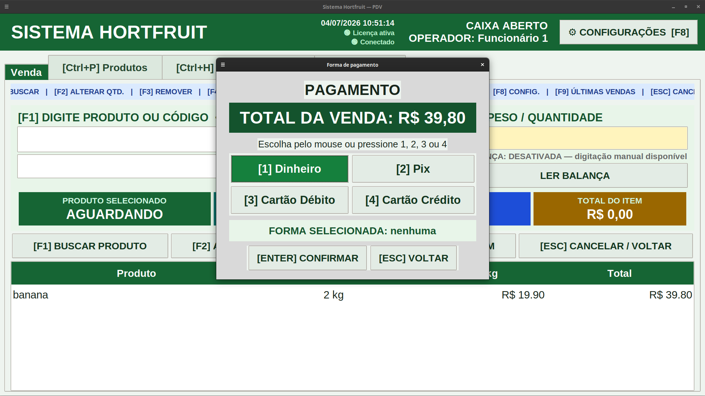
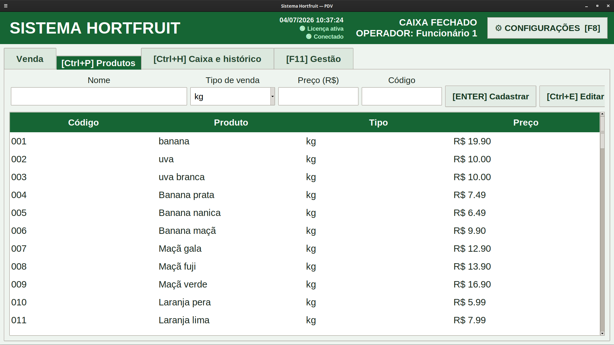
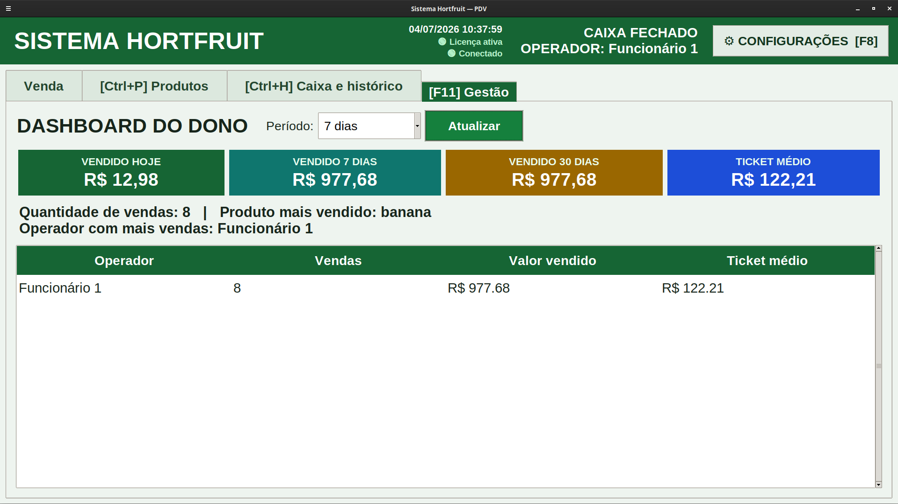
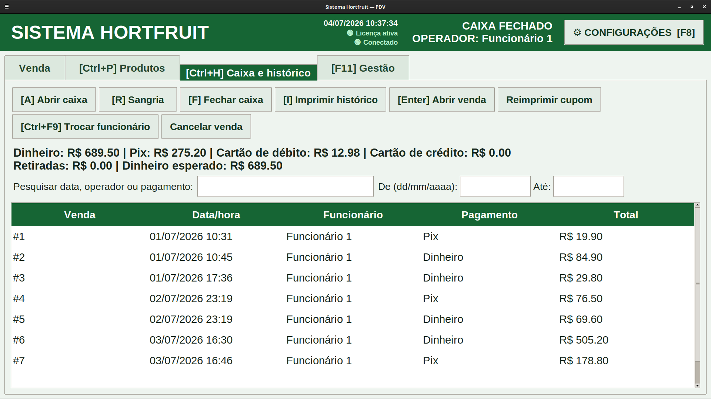
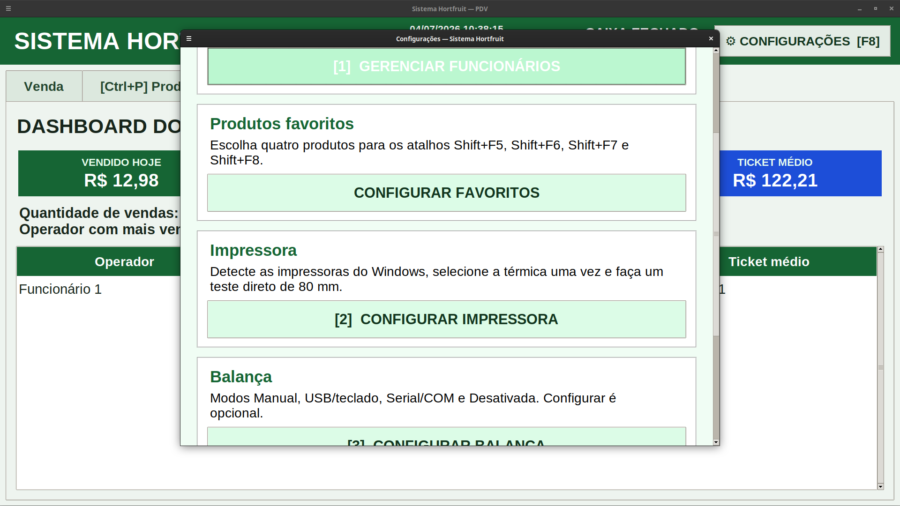
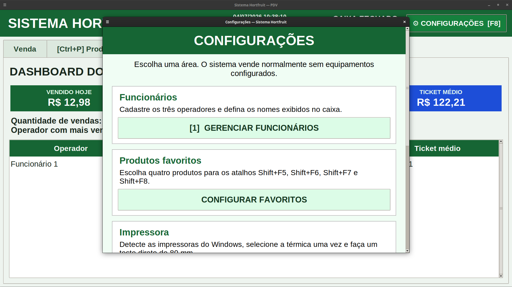

# SistemaHortfruit-Portfolio
# Sistema Hortfruit

Sistema de gestão para hortifrúti desenvolvido em Python.

## Funcionalidades

- Venda por peso (kg)
- Venda por unidade
- Pesquisa rápida de produtos
- Controle de caixa
- Histórico de vendas
- Dashboard administrativo
- Impressão térmica ESC/POS
- Operação totalmente por teclado
- Backup automático
- Sistema de licenciamento

## Tecnologias

- Python
- SQLite
- PyInstaller
- ESC/POS
- Git
- GitHub

## Login

## Tela de Venda

## Pesquisa de Produtos

## Forma de Pagamento

## Produtos

## Dashboard

## Caixa e Histórico

## Configurações

## Configurações Iniciais

## Cupom Impresso

.png)

## Autor

Samuel Barbosa da Silva

SBS Tech
